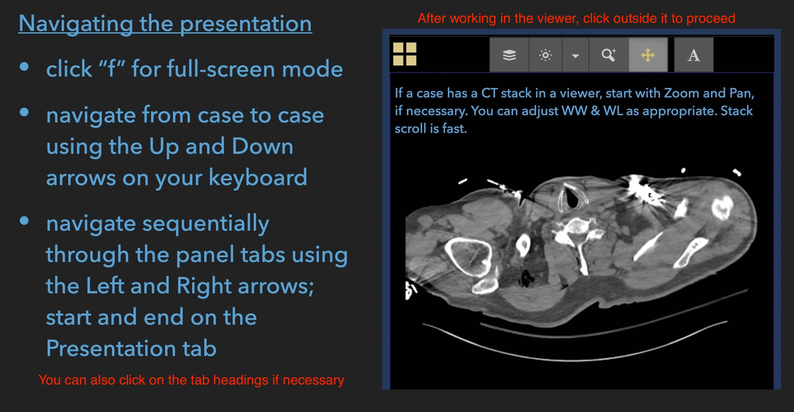
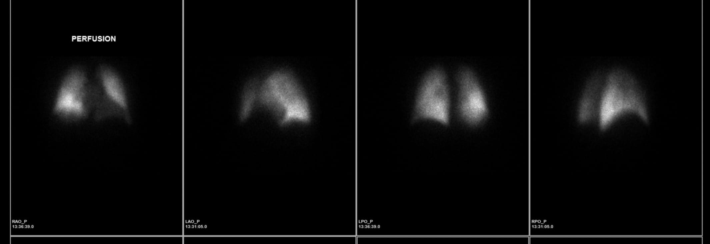

```{r setup, include = FALSE}
options(htmltools.dir.version = FALSE)
library(knitr)
library(xaringanExtra)
library(showtext)
library(kableExtra)
opts_chunk$set(echo=FALSE)

# set engines
knitr::knit_engines$set("markdown")

xaringanExtra::use_panelset()
# xaringanExtra::use_share_again()
xaringanExtra::use_tile_view()

```

```{r xaringan-themer, include=FALSE, warning=FALSE}
library(xaringanthemer) 
style_mono_light(base_color = "#23395b")
```

class: center, middle




---
class: inverse
name: case panelset

.small[Case 1]

.panelset[

.panel[.panel-name[Clinical Presentation]
.left[
Presentation: Blunt Chest Trauma]
] <!--end of panel-->

.panel[.panel-name[Chest Radiography]

```{r out.width='100%'}

```


] <!--end of panel-->

.panel[.panel-name[Computed Tomography]

.small[After left pleural drain placement]

<div style="text-align:center;">
<iframe class="pacsbin"
         id="case1"
         src="https://www.pacsbin.com/c/W1lFIP0OC8?s=60674905b224852f2731b1b9&i=60674905b224852f2731b1ba&ww=620&wc=58&an=false&header=false&notes=false&overlay=false" 
         style="width: 450px; height: 450px; border: 0;"></iframe>
</div>


] <!--end of panel-->
] <!--end of panelset-->

---

class: inverse
name: case panelset

Case 2

.panelset[

.panel[.panel-name[Clinical Presentation]
.left[
Presentation: Blunt Abdomino-pelvic trauma]
] <!--end of panel-->

.panel[.panel-name[Chest Radiography]

.small[What interesting finding is present?]

```{r out.width='65%'}

```


] <!--end of panel-->

.panel[.panel-name[Computed Tomography]

.small[Do you see the reason for it?]

<div style="text-align:center;">
<iframe class="pacsbin"
         id="case2"
         src="https://www.pacsbin.com/c/ZJ7M9wJYC8?s=606762bab224852f2731b5b6&i=606762bab224852f2731b5b7&ww=400&wc=40&an=false&header=false&notes=false&overlay=false" 
         style="width: 500px; height: 500px; border: 0;"></iframe>
</div>


] <!--end of panel-->
] <!--end of panelset-->

---

class: inverse
name: case panelset

Case 3

.panelset[

.panel[.panel-name[Clinical Presentation]
.left[
The CXR was obtained to assess PICC placement in a patient being treated for lumbar infectious diskitis.
]
] <!--end of panel-->

.panel[.panel-name[Chest Radiography]

.small[Something needs to be done next. Can you determine why and what ?]

```{r out.width='50%'}

```
] <!--end of panel-->

] <!--end of panelset-->

---

class: inverse
name: case panelset

Case 4

.panelset[

.panel[.panel-name[Clinical Presentation]
.left[
Presentation: This patient underwent uneventful resection of a large adrenal mass]

] <!--end of panel-->

.panel[.panel-name[Chest Radiography]

.small[This was performed on the first post-operative day. 
What is the Impression of your report?
]

```{r out.width='80%'}

```


] <!--end of panel-->

.panel[.panel-name[Computed Tomography]

.small[What is your diagnosis?]

<div style="text-align:center;">
<iframe class="pacsbin"
         id="case4"
         src="https://www.pacsbin.com/c/Wk-tNHgFRU?s=6067782d25ee0c3888a7aa99&i=6067782d25ee0c3888a7aab3&ww=400&wc=40&an=false&header=false&notes=false&overlay=false" 
         style="width: 450px; height: 450px; border: 0;"></iframe>
</div>


] <!--end of panel-->
] <!--end of panelset-->

---

class: inverse
name: case panelset

Case 5

.panelset[

.panel[.panel-name[Clinical Presentation]
.left[
Presentation: A patient with chest pain and respiratory distress.]

] <!--end of panel-->

.panel[.panel-name[Chest Radiography]

.small[Where is the abnormality located ? Hint: A classic radiology sign is present. 
]

```{r out.width='45%'}

```


] <!--end of panel-->

.panel[.panel-name[Computed Tomography]

.small[Additional information: Serum AFP is markedly elevated.
What's the diagnosis ?]

<div style="text-align:center;">
<iframe class="pacsbin"
         id="case5"
         src="https://www.pacsbin.com/c/-kEHDKftA8?s=6067b2de1b4e713d763c41e8&i=6067b2de1b4e713d763c4206&ww=719&wc=122&an=false&header=false&notes=false&overlay=false" 
         style="width: 450px; height: 450px; border: 0;"></iframe>
</div>


] <!--end of panel-->
] <!--end of panelset-->

---


class: inverse
name: case panelset

Case 6

.panelset[

.panel[.panel-name[Clinical Presentation]
.left[
Presentation: A perplexed cardiologist needs help with this image. 

What single historical item do you want to know ?]

] <!--end of panel-->

.panel[.panel-name[Chest Radiography]


```{r out.width='100%'}

```


] <!--end of panel-->


] <!--end of panelset-->

---

class: inverse
name: case panelset

Case 7

.panelset[

.panel[.panel-name[Clinical Presentation]
.left[
A patient with chronic, progressive exertional dyspnea.]

] <!--end of panel-->

.panel[.panel-name[Chest Radiography]

.small[Hint: analysis of vessels is important. 
]

```{r out.width='70%'}

```


] <!--end of panel-->

.panel[.panel-name[Perfusion scan]


```{r out.width='50%'}
knitr::include_graphics("images/Qscan.jpg")
```


] <!--end of panel-->

.panel[.panel-name[Axial CT]

<div style="text-align:center;">
<iframe class="pacsbin"
         id="casex"
         src="https://www.pacsbin.com/c/b1RW7lNYCI?s=6067d49a1b4e713d763c4250&i=6067d49a1b4e713d763c4251&ww=1500&wc=-500&an=false&header=false&notes=false&overlay=false" 
         style="width: 450px; height: 450px; border: 0;"></iframe>
</div>


] <!--end of panel-->

.panel[.panel-name[Axial MIP CT]

<div style="text-align:center;">
<iframe class="pacsbin"
         id="casexy"
         src="https://www.pacsbin.com/c/WJXI8xVYRU?s=6067d78a1b4e713d763c42a7&i=6067d78a1b4e713d763c42a8&ww=1771&wc=-243&an=false&header=false&notes=false&overlay=false" 
         style="width: 450px; height: 450px; border: 0;"></iframe>
</div>

What's your provisional diagnosis ?

] <!--end of panel-->
] <!--end of panelset-->

---

class: inverse
name: case panelset

Case 8

.panelset[

.panel[.panel-name[Clinical Presentation]
.left[
A patient without respiratory-chest symptoms.]

] <!--end of panel-->

.panel[.panel-name[Chest Radiography]


```{r out.width='75%'}

```


] <!--end of panel-->

.panel[.panel-name[Computed Tomography]


<div style="text-align:center;">
<iframe class="pacsbin"
         id="casexxy"
         src="https://www.pacsbin.com/c/byzshXVKRL?s=6067dd3a1b4e713d763c42ff&i=6067dd3a1b4e713d763c4300&ww=663&wc=66&an=false&header=false&notes=false&overlay=false" 
         style="width: 450px; height: 450px; border: 0;"></iframe>
</div>


] <!--end of panel-->
] <!--end of panelset-->

---

class: inverse
name: case panelset

Case 9

.panelset[

.panel[.panel-name[Clinical Presentation]
.left[
A patient with findings of pulmonary hypertension on cardiac ultrasound.]

] <!--end of panel-->

.panel[.panel-name[Chest Radiography]


```{r out.width='75%'}

```


] <!--end of panel-->

.panel[.panel-name[Q scan]


```{r out.width='85%'}

```


] <!--end of panel-->

.panel[.panel-name[Computed Tomography]


<div style="text-align:center;">
<iframe class="pacsbin"
         id="case5"
         src="https://www.pacsbin.com/c/Zyn15LEYCI?s=6067e1d71b4e713d763c43fc&i=6067e1d71b4e713d763c43fd&ww=1515&wc=-498&an=false&header=false&notes=false&overlay=false" 
         style="width: 450px; height: 450px; border: 0;"></iframe>
</div>

Hmm. The second case of pulmonary hypertension. This is more difficult. Good luck!


] <!--end of panel-->
] <!--end of panelset-->

---


class: inverse
name: case panelset

Case 10

.panelset[

.panel[.panel-name[Clinical Presentation]
.left[
A patient being treated for septic embolism. A CTPA was performed.

Another tough (perceptual) case. Evaluate the vessels carefully. Are emboli present ?]

] <!--end of panel-->


.panel[.panel-name[CTPA]


<div style="text-align:center;">
<iframe class="pacsbin"
         id="case5"
         src="https://www.pacsbin.com/c/Z1lHnuEFRU?s=6067e5131b4e713d763c44a5&i=6067e5131b4e713d763c44a6&ww=649&wc=116&an=false&header=false&notes=false&overlay=false" 
         style="width: 450px; height: 450px; border: 0;"></iframe>
</div>


] <!--end of panel-->
] <!--end of panelset-->

---

class: inverse
name: case panelset

Case 11

.panelset[

.panel[.panel-name[Clinical Presentation]
.left[
A patient provides a history of recurrent lung infections over many years.]

] <!--end of panel-->

.panel[.panel-name[Chest Radiography]


```{r out.width='75%'}

```


] <!--end of panel-->

.panel[.panel-name[Chest CT]

4 weeks later. 


```{r out.width='100%'}

```


] <!--end of panel-->

.panel[.panel-name[Chest CT 2]

Another infection two years later!


```{r out.width='100%'}

```


] <!--end of panel-->
] <!--end of panelset-->

---

class: inverse
name: case panelset

Case 12

.panelset[

.panel[.panel-name[Clinical Presentation]
.left[
Chest radiography ostensibly shows a right central mass, consistent with a primary lung cancer.
]

] <!--end of panel-->

.panel[.panel-name[Chest Radiography]


```{r out.width='45%'}

```

.small[Wait, is there something else too ?]

] <!--end of panel-->


.panel[.panel-name[CT]


<div style="text-align:center;">
<iframe class="pacsbin"
         id="case5xlf"
         src="https://www.pacsbin.com/c/-1WC7xHFCL?s=6067f0481b4e713d763c44fb&i=6067f0481b4e713d763c44fc&ww=413&wc=87&an=false&header=false&notes=false&overlay=false" 
         style="width: 450px; height: 450px; border: 0;"></iframe>
</div>

Can you explain the peripheral opacity?

] <!--end of panel-->

] <!--end of panelset-->


---

class: inverse
name: case panelset

Case 13

.panelset[

.panel[.panel-name[Clinical Presentation]
.left[
An EKG in this breathless patient shows third-degree heart block.
]

] <!--end of panel-->

.panel[.panel-name[Chest Radiography]


```{r out.width='55%'}

```


Can you suggest why he may be breathless ? A CTPA was requested. Surprised ?

] <!--end of panel-->


.panel[.panel-name[CTPA]


<div style="text-align:center;">
<iframe class="pacsbin"
         id="case5xlf"
         src="https://www.pacsbin.com/c/WyI8PfBFR8?s=6067f48a20934b4f6f76f4a5&i=6067f48a20934b4f6f76f4a6&ww=975&wc=69&an=false&header=false&notes=false&overlay=false" 
         style="width: 450px; height: 450px; border: 0;"></iframe>
</div>

What's the explanation for his symptoms ?

] <!--end of panel-->

] <!--end of panelset-->

---

class: inverse
name: case panelset

Case 14 —  Last quick one!

.panelset[

.panel[.panel-name[Clinical Presentation]
.left[
The asymptomatic person was sent over from this dentist's office (at least, that's what I got from Epic).
]

] <!--end of panel-->

.panel[.panel-name[Chest Radiography]


```{r out.width='55%'}

```

] <!--end of panel-->
] <!--end of panelset-->


```{css echo=FALSE}
.highlight-last-item > ul > li, 
.highlight-last-item > ol > li {
  opacity: 0.2;
}
.highlight-last-item > ul > li:last-of-type,
.highlight-last-item > ol > li:last-of-type {
  opacity: 1;
}
```

